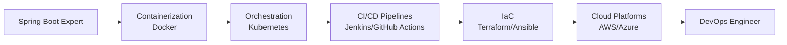

I'll help you enhance your GitHub profile README to reflect your aspirations in DevOps and Microservices. Let me search for some current trends and impressive content ideas for developer portfolios.
Based on current best practices and impressive portfolio trends, here's your enhanced GitHub profile README tailored for a **DevOps aspirant with Spring Boot & Microservices expertise**:

```markdown
# 👋 Hi, I'm Manikandan S
**DevOps Enthusiast | Spring Boot & Microservices Specialist | Cloud-Native Developer**

<div align="center">
  
</div>

## 🚀 About Me

```java
public class Manikandan {
    private String role = "Student & Aspiring DevOps Engineer";
    private String[] expertise = {"Spring Boot", "Microservices", "Cloud-Native Dev"};
    private String[] learning = {"Docker", "Kubernetes", "CI/CD", "Terraform", "AWS"};
    private String passion = "Automating everything & Building resilient systems";
    
    public String getMission() {
        return "Bridging the gap between development and operations";
    }
}
```

- 🔭 **Currently Working On:** Microservices architecture projects with Spring Cloud
- 🌱 **Learning:** DevOps toolchain (Docker, Kubernetes, Jenkins, GitHub Actions)
- 👯 **Looking to collaborate on:** Open-source DevOps tools & Spring Boot projects
- 💬 **Ask me about:** REST APIs, Microservices patterns, Spring Boot best practices
- ⚡ **Fun fact:** I believe "If you have to do it twice, automate it!"

## 🌐 Connect With Me

<div align="center">
  
[](mailto:manirevathi404@gmail.com)
[](https://www.linkedin.com/in/manikandan-s-133179364/)
[](https://portfolio-version-3-ecru.vercel.app/)
[](https://github.com/stevekalix)

</div>

## 🛠️ Tech Stack & Tools

### 💻 Languages & Frameworks
<div align="center">
  
</div>

### 🚀 DevOps & Cloud (Learning & Applying)
<div align="center">
  
</div>

### 🗄️ Databases & Tools
<div align="center">
  
</div>

## 🏗️ Featured Projects

### 🔹 Microservices Architecture with Spring Boot
**[View Repository](#)** | `Spring Boot` `Eureka` `API Gateway` `Docker`
- Built a scalable e-commerce platform using microservices pattern
- Implemented service discovery, load balancing, and distributed tracing
- Containerized services with Docker for consistent deployments

### 🔹 CI/CD Pipeline Automation
**[View Repository](#)** | `GitHub Actions` `Jenkins` `Docker` `AWS`
- Automated build, test, and deployment workflows
- Integrated code quality checks and security scanning
- Achieved 70% faster deployment times

### 🔹 Cloud-Native Task Management App
**[View Repository](#)** | `Flutter` `Spring Boot` `AWS` `MySQL`
- Full-stack application with microservices backend
- Deployed on AWS EC2 with auto-scaling configurations
- Implemented monitoring and logging with CloudWatch

## 📊 GitHub Statistics

<div align="center">
  <table>
    <tr>
      <td align="center">
        
      </td>
      <td align="center">
        
      </td>
    </tr>
  </table>
</div>

<div align="center">
  
</div>

## 🏆 GitHub Trophies
<div align="center">
  
</div>

## 📈 Contribution Graph
<div align="center">
  
</div>

## 🎯 Current Learning Roadmap



## 📝 Latest Blog Posts (Coming Soon!)
<!-- BLOG-POST-LIST:START -->
- 🚀 Getting Started with Microservices: A Student's Guide
- 🔧 Containerizing Spring Boot Applications: Best Practices
- 📊 Monitoring Microservices with Prometheus & Grafana
<!-- BLOG-POST-LIST:END -->

---
<div align="center">
  
  
</div>

<div align="center">
  <h3>💡 "Infrastructure as Code, Configuration as Data, and Automation as Religion" 💡</h3>
</div>

<div align="center">
  
